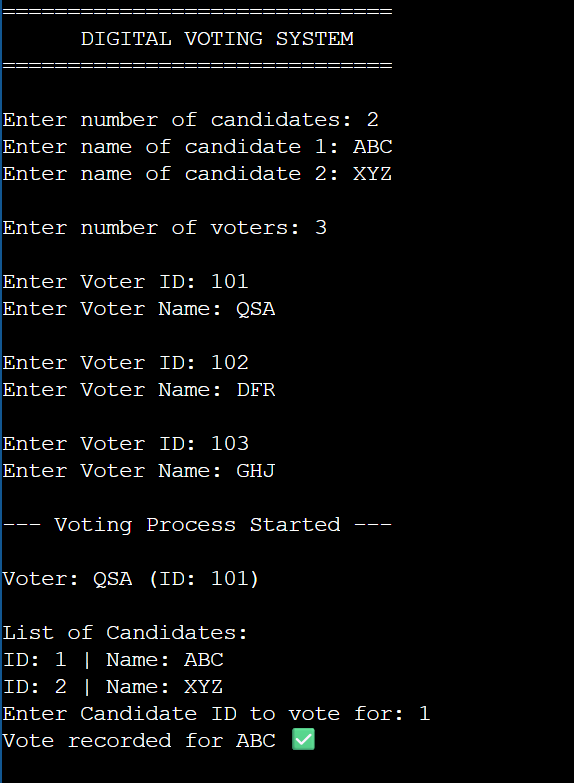
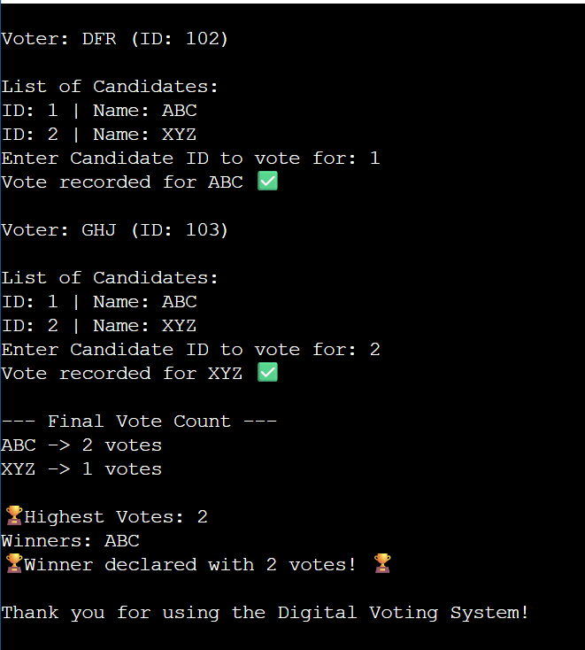

# 🗳️ Digital Voting System (C++)

## 📘 Overview
This project is a **Digital Voting System** built using **C++**, simulating an electronic voting process where candidates and voters are registered, and votes are cast in a fair, sequential manner.

## 🎯 Aim
To implement a voting management system using **Linked List** and **Queue** data structures for efficient registration and vote handling.

## ⚙️ Features
- Candidate registration
- Voter registration
- Voting process (FIFO order)
- Vote counting and winner display
- Data structure-based design (Linked List + Queue)

## 🧩 Data Structures Used
| Data Structure | Use |
|----------------|-----|
| Linked List | To store candidates and their votes |
| Queue | To manage voter order |
| Array | For temporary data storage |

## 🧮 Algorithm
1. Register all candidates using a Linked List  
2. Register all voters using a Queue  
3. Dequeue each voter → vote for candidate  
4. Count votes and display results

## ⏱️ Time Complexity
| Operation | Complexity |
|------------|-------------|
| Registration | O(1) |
| Voting | O(n) |
| Result Display | O(n) |

## 💻 Technologies
- C++ Programming Language  
- Data Structures and Algorithms  
- Object-Oriented Programming  

## 👨‍💻 Developed By
**Name:** Sarthak Khedekar  
**Institute:** PES Modern Collage Of Engineering, Pune  
**Branch:** B.Tech in Artificial Intelligence & Machine Learning 
**Mini Project:** Digital Voting System

## 📸 Sample Output

**Program Menu**

**Result Screen**

